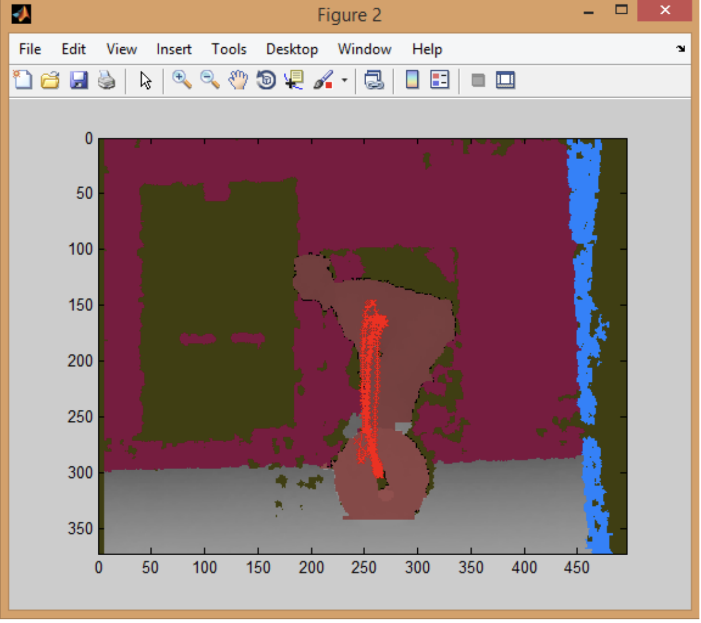

## Portfolio

---

### Estimating MPG
##### _August 2020_
- [Jupyter Notebook Page](/pdf/MPG Estimation.html)
- [All Files](https://github.com/mclougher/mpg)

---

### Ontology for Health Through Exercise and Nutrition (OHEN)
##### _August 2020_
- [Summary Paper](/pdf/Final Paper.pdf)
- [Jupyter Notebook Page](/pdf/Building OHEN.html)
- [All Files](https://github.com/mclougher/ohen)

---

### Covid-19-Sweden-Analysis 
##### _April 2020_
- [Jupyter Notebook Page](/pdf/Covid-19 Analysis.html)
- [All Files](https://github.com/mclougher/Covid-19-Sweden-Analysis)

---
### Creating an Automated Coaching Assistant 
##### _December 2014_

- [Paper](/pdf/Creating an Automated Coaching Assistant.pdf)
- [PowerPoint Presentation](/pdf/Creating an Automated Coaching Assistant.pptx)
- [All Files](https://github.com/mclougher/Automated-Coaching-Assistant)

---

Page template forked from <a href="https://github.com/evanca/quick-portfolio">evanca</a>

<!-- Remove above link if you don't want to attibute -->
